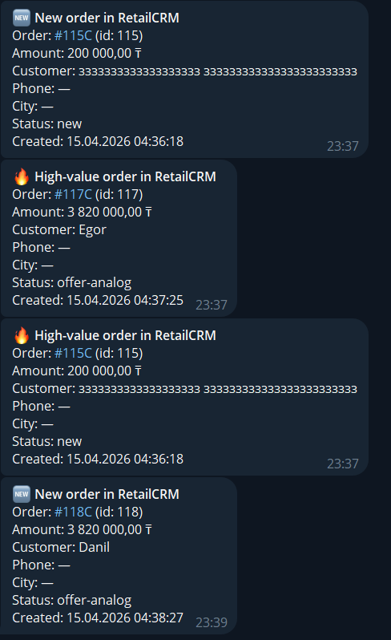

# 📦 Orders Dashboard

Дашборд мониторинга заказов RetailCRM с синхронизацией в Supabase, Telegram-ботом и деплоем на Vercel.

 😎 [Ссылка на дашборд](https://orders-dashboard-tau.vercel.app/)
---

## 🔧 Стек

| Сервис | Назначение |
|---|---|
| [RetailCRM](https://alikhanserik41.retailcrm.ru) | Источник заказов |
| [Supabase](https://iyleoysbwqdwuwrreaam.supabase.co) | База данных (PostgreSQL) |
| Telegram Bot `8627109829` | Уведомления о крупных заказах |
| Vercel | Хостинг дашборда |

---

## 🚀 Быстрый старт

### 1. Установить зависимости
```bash
npm install
```

### 2. Создать таблицу в Supabase
1. Открыть файл `supabase/schema.sql` в редакторе
2. Скопировать **всё содержимое** файла (Ctrl+A → Ctrl+C)
3. Вставить в [Supabase SQL Editor](https://supabase.com/dashboard/project/iyleoysbwqdwuwrreaam/sql) и нажать **Run**

### 3. Синхронизировать заказы из RetailCRM → Supabase
```bash
npm run sync
```

### 4. Запустить Telegram-бота
```bash
npm run bot
```

### 5. Открыть дашборд локально
```bash
npm run dev
# → http://localhost:3000
```

---

## 📁 Структура

```
orders-dashboard/
├── 📂 dashboard/            # Файлы визуальной панели
│   └── index.html           # Основная страница дашборда (HTML/JS/Charts)
├── 📂 scripts/              # Автоматизация и работа с данными
│   ├── sync_to_supabase.js  # Фоновая синхронизация RetailCRM → Supabase
│   ├── import_mock_to_crm.js# Импорт тестовых заказов в RetailCRM
│   └── upload_to_retailcrm.js# Утилита для загрузки данных в CRM
├── 📂 telegram-bot/         # Умный уведомляющий бот
│   └── bot.js               # Обработка уведомлений и Telegram-команд
├── 📂 supabase/             # Настройки базы данных
│   └── schema.sql           # SQL-структура таблиц для развертывания
├── 📂 scratch/              # Диагностические и вспомогательные скрипты
├── mock_orders.json         # Тестовые данные для импорта
├── vercel.json              # Конфигурация для деплоя на Vercel
├── .env                     # Секретные ключи и URL (не для GitHub!)
├── .gitignore               # Список исключений для Git
└── package.json             # Зависимости и скрипты запуска
```

---

## 🤖 Команды Telegram-бота

| Команда | Описание |
|---|---|
| `/start` | Приветствие и список команд |
| `/stats` | Общая статистика заказов |
| `/top` | Топ-5 заказов по сумме |
| `/latest` | Последние 5 заказов |

Бот автоматически уведомляет при поступлении заказов **≥ 50 000 ₸**.

---

## ☁️ Деплой на Vercel

```bash
# Установить Vercel CLI
npm i -g vercel

# Добавить секреты
vercel secrets add retailcrm_api_key "i0LuTWzRPrJZdWrA385f3MUXoR68sZNZ"
vercel secrets add supabase_key "sb_publishable_qenEdWww0JR5BnTMaR-Uwg_S1yEfix_"
vercel secrets add telegram_bot_token "8627109829:AAHveG-OW3uFF5fTBDY7vwio8pdM-pygh1c"

# Деплой
vercel --prod
```

---

## 🔑 Переменные окружения (.env)

```env
RETAILCRM_URL=https://alikhanserik41.retailcrm.ru
RETAILCRM_API_KEY=...
SUPABASE_URL=https://iyleoysbwqdwuwrreaam.supabase.co
SUPABASE_KEY=...
TELEGRAM_BOT_TOKEN=...
TELEGRAM_CHAT_ID=8627109829
```

> ⚠️ Файл `.env` добавлен в `.gitignore` — токены не попадут в репозиторий.

---

## 📊 Схема данных

```sql
orders (
  id              BIGINT PRIMARY KEY,   -- ID заказа RetailCRM
  number          TEXT UNIQUE,          -- Номер заказа
  total_summ      NUMERIC,              -- Сумма в тенге
  status          TEXT,                 -- Статус заказа
  customer_*      TEXT,                 -- Данные клиента
  notified        BOOLEAN,              -- Отправлено уведомление в Telegram
  uploaded_to_crm BOOLEAN,             -- Загружено обратно в CRM
  created_at      TIMESTAMPTZ,
  updated_at      TIMESTAMPTZ
)
```

# 📊 RetailCRM Analytics Dashboard Suite

Интеллектуальная система мониторинга заказов, объединяющая RetailCRM, Supabase и Telegram в единую экосистему для управления продажами и аналитики.

## 🚀 Основной функционал
- **Real-time Dashboard**: Веб-интерфейс с премиальным дизайном для отслеживания выручки и статусов.
- **Telegram VIP Bot**: Уведомления о крупных заказах (от 50,000 ₸) с полной информацией о клиенте.
- **Автоматическая синхронизация**: Фоновый движок, обновляющий данные каждые 2 минуты.
- **Import Tool**: Скрипт для быстрой загрузки тестовых данных из JSON в CRM.

---

## 📝 Хронология развития (Prompts)

В ходе разработки использовались следующие ключевые запросы:

1. **Инициализация**: Создание базы дашборда на HTML/JS с интеграцией Supabase и Telegram.
2. **Адаптация схемы**: Обновление кода под раздельные поля имени/фамилии и новое поле `total_summ`.
3. **Автоматизация**: Перевод синхронизации и бота в полностью автономный фоновый режим.
4. **Кастомизация уведомлений**: Настройка подробных карточек заказов в Telegram (город, телефон, ID).
5. **Импорт данных**: Перенос 25 заказов из `mock_orders.json` в RetailCRM через API.
6. **Бизнес-логика и Деплой**: Установка порога уведомлений 50к+ и развертывание на Vercel.

---

## ⚡ Технические вызовы и решения

В процессе работы мы столкнулись с несколькими критическими барьерами:

### 1. Ошибки доступа (RLS & Keys)
*   **Где застряли**: Сайт выдавал `TypeError: Failed to fetch` или `Access Error` при попытке прочитать данные из Supabase.
*   **Решение**: Перешли на использование **Supabase SDK** вместо сырых fetch-запросов. В базе данных применили команду `ALTER TABLE orders DISABLE ROW LEVEL SECURITY`, чтобы разрешить публичный доступ к дашборду через Publishable Key.

### 2. Конфликты API RetailCRM
*   **Где застряли**: При импорте заказов CRM возвращала ошибки `400 Bad Request` из-за неправильного формата даты и отсутствия обязательного параметра `site`.
*   **Решение**: Написали диагностические скрипты для получения актуальных кодов магазинов (`check_sites.js`) и статусов. Переформатировали даты из ISO в формат `Y-m-d H:i:s`.

### 3. Дубликаты заказов
*   **Где застряли**: Синхронизация падала с ошибкой `duplicate key value` из-за уникального индекса на колонке `number`.
*   **Решение**: Сняли ограничение `UNIQUE` в базе данных (`DROP CONSTRAINT`) и внедрили дедупликацию в памяти на уровне скрипта синхронизации.

### 4. Ограничения безопасности браузеров
*   **Где застряли**: Прямое использование Secret Key в браузере блокировалось Supabase (`Forbidden use of secret API key in browser`).
*   **Решение**: Архитектурно разделили ключи. Secret Key используется только на сервере (синхронизация/бот), а на сайте — только Publishable Key с открытым доступом к таблице.

---

## 🛠️ Как запустить проект

1. **Настройка окружения**: Создайте файл `.env` на основе примера и впишите свои ключи.
2. **База данных**: Выполните SQL-скрипт из `supabase/schema.sql` в редакторе Supabase.
3. **Запуск сервисов**:
   ```bash
   npm install        # Установка зависимостей
   npm run dev        # Локальный запуск сайта
   node scripts/sync_to_supabase.js  # Запуск синхронизации
   node telegram-bot/bot.js          # Запуск бота
   ```
4. **Деплой**: Используйте `npx vercel --prod` для публикации дашборда.

---
### Скриншот Telegram-уведомления(БОТ)



